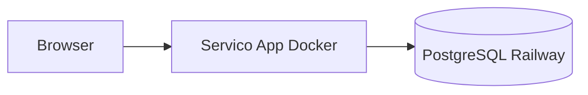

# Deploy no Railway (app + Postgres)

Um único serviço Docker: Express serve `/api` + SPA React (`dist`) na mesma URL.  
Base de dados: **PostgreSQL no Railway** (não Supabase, não Vercel).

> Segredos locais: [`docs/railway-variables.env`](railway-variables.env) (gitignore).

## Arquitetura



## 1. Projeto Railway

1. [railway.com](https://railway.com) → **New Project**
2. **+ New** → **GitHub Repo** → `Sloot2` (branch `main`)
3. **+ New** → **Database** → **PostgreSQL** (no mesmo projeto)
4. Serviço **app** → **Settings** → Builder: **Dockerfile** ([`railway.toml`](../railway.toml))

## 2. Ligar Postgres à app

No serviço **app** → **Variables** → **Raw Editor**:

```env
NODE_ENV=production
DATABASE_URL=${{Postgres.DATABASE_URL}}
DIRECT_URL=${{Postgres.DATABASE_URL}}
JWT_SECRET=<openssl rand -base64 48>
DEFAULT_TENANT_SLUG=two-brothers
FRONTEND_URL=https://TEU-DOMINIO.up.railway.app
VITE_DEFAULT_TENANT_SLUG=two-brothers
GOOGLE_CLIENT_ID=
VITE_GOOGLE_CLIENT_ID=
```

| Regra | Detalhe |
|-------|---------|
| `DATABASE_URL` / `DIRECT_URL` | **Sempre** referência `${{Postgres.DATABASE_URL}}` — nunca URL Supabase |
| `PORT` | **Não definir** |
| `VITE_API_URL` | **Não definir** |
| `SUPABASE_*` / `VITE_SUPABASE_*` | **Não definir** (reset de senha por e-mail fica desactivado) |
| `VITE_*` | Entram no **build** Docker — após alterar, **Redeploy** |

## 3. Banco novo (primeira vez)

Com TCP Proxy no Postgres, no PC:

```powershell
$env:DATABASE_URL="<URL_PUBLICA_RAILWAY>"
$env:DIRECT_URL=$env:DATABASE_URL
$env:DEFAULT_TENANT_SLUG="two-brothers"
npm run db:railway:setup
```

Ou só schema: `npm run db:migrate:deploy` (o arranque da app também corre `migrate deploy`).

**Não** corras `db:seed` contra um banco com dados reais que queres manter.

## 4. Domínio e deploy

1. App → **Settings** → **Networking** → **Generate Domain**
2. Actualiza `FRONTEND_URL` com esse domínio → **Redeploy**
3. Logs de deploy: `Migrations aplicadas` + `slooti — produção`

## 5. Verificar

Substitui `TEU-DOMINIO`:

| URL | Esperado |
|-----|----------|
| `/health` | `"dbConfigured": true`, `"dbHost"` com `railway` (não `supabase.com`) |
| `/api/tenant/resolve/two-brothers` | JSON do tenant |
| `/two-brothers/cliente` | Agendamento |
| `/two-brothers/barbeiros/login` | `carlos@barberpro.com` / `123` (se usaste seed) |

Admin plataforma (uma vez):

```bash
cd server && npm run create:platform-admin -- seu@email.com SuaSenha
```

## 6. Desligar Vercel / Supabase

| Serviço | Acção |
|---------|--------|
| **Vercel** | Apagar ou desactivar projeto `sloot2` (código já não usa `vercel.json` / `api/`) |
| **Supabase Postgres** | Deixar de usar — app não liga se variáveis forem só Railway |
| **Supabase Auth** | Opcional pausar projeto; recuperação de senha no `/cliente` só funciona com `SUPABASE_*` |

## Troubleshooting

| Problema | Solução |
|----------|---------|
| `dbHost` com `supabase.com` | Variáveis da app ainda apontam ao Supabase — corrige e redeploy |
| `dbConfigured: false` | Falta `DATABASE_URL` no serviço app |
| `relation "Tenant" does not exist` | Migrations não correram — vê logs do start; `db:railway:setup` |
| Healthcheck falha | Não defines `PORT`; confirma `JWT_SECRET` |
| Build Nix / sem espaço | Usa **Dockerfile** ([`railway.toml`](../railway.toml)) |

Ver também: [MIGRATE-POSTGRES-RAILWAY.md](./MIGRATE-POSTGRES-RAILWAY.md) (detalhe histórico Supabase → Railway).
